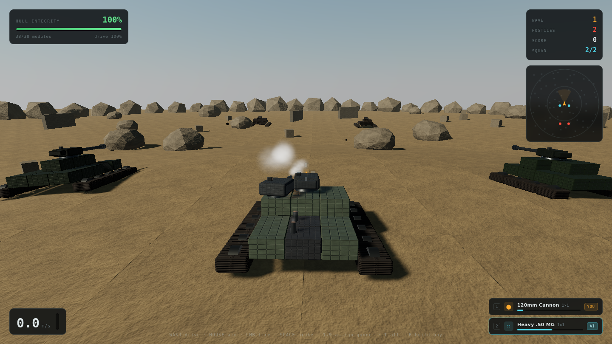
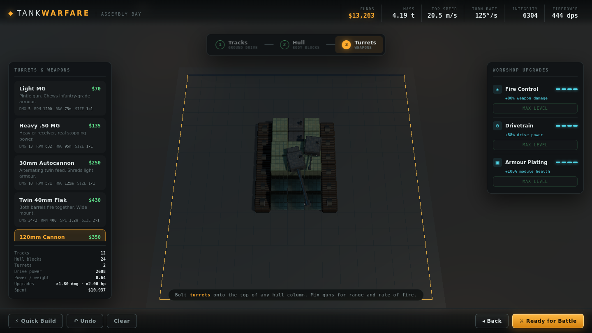

# TankWarfare

Design a tank plate by plate, then drive it into a third-person armoured battle.

Built with [Three.js](https://threejs.org). No build step, no bundler, no image assets — every
texture, sound and particle is generated procedurally at load time.

**▶ [Play it](https://fanaustinca.github.io/tankwarfare/)**



---

## Build Mode

A bird's-eye assembly deck with three phases:

| Phase | What you place | Why it matters |
|---|---|---|
| **1 · Tracks** | Tread sections on the ground grid | Drive power and top speed. Two parallel runs, hull between them. |
| **2 · Hull** | Structural blocks, stackable 3 layers | Health, mass and the platform your guns sit on. |
| **3 · Turrets** | Weapons on top of any hull column | Firepower — and big guns need a big platform. |

Everything costs money, and every kilogram costs speed. The live readout shows funds, mass,
top speed, turn rate, integrity and firepower as you build, so the trade-offs are visible
while you make them.



### Turrets take up space

Guns occupy a real footprint on the hull, so the big ones have to be designed around:

| Turret | Size | Notes |
|---|---|---|
| Light MG / Heavy .50 MG | 1×1 | Cheap suppression at two weight classes |
| 30mm Autocannon | 1×1 | Twin barrels that **alternate** — high sustained rate |
| Twin 40mm Flak | 2×1 | Both barrels fire **at once** |
| 120mm Cannon | 1×1 | The dependable main gun |
| Double 105mm | 2×1 | Two shells downrange per trigger pull |
| **155mm Siege Gun** | **2×2** | Devastating; needs a flat 2×2 platform to mount |
| Missile Pod | 1×1 | Guided warheads with a wide splash |

### Workshop upgrades

Three upgrade tracks, bought once and applied to every part of that class — Fire Control
(damage), Drivetrain (power), and Armour Plating (module health). Four levels each, escalating cost.

## Battle Mode

Third-person combat across a 230 m battlefield of rock, blast walls and bunkers.

- **Physics** — momentum, mass-limited acceleration, terrain following and body roll all derive
  from what you actually built. A heavy tank wallows; a light one skitters.
- **Localised damage** — every track, plate and turret is its own module with its own health.
  Lose tracks and you slow down; lose a turret and that gun is gone. Damaged modules smoke and
  spark, and sloped armour deflects a share of incoming fire. A tank dies from *structural*
  collapse, not a single health bar.
- **AI** — hostile crews patrol, close on contact, flank toward your last known position, take
  hard cover when hurt, and lead their shots. Crew skill scales with wave tier.
- **Squad** — you fight alongside AI wingmen running the same AI on your side. Wrecked
  wingmen are replaced between waves.
- **Gunner assignment** — hand any turret to an AI gunner that acquires and engages its own
  targets, or keep it on your crosshair. Mix and match mid-fight.

### Controls

| Input | Action |
|---|---|
| `W` `A` `S` `D` | Drive |
| Mouse | Aim (click to capture the pointer) |
| Left mouse | Fire your manually-crewed guns |
| Right mouse | Zoom in |
| `Space` | Brake |
| `1`–`9` | Toggle that turret between **YOU** and **AI** |
| `T` | Toggle every turret at once |
| `B` / `Esc` | Back to the assembly bay |
| `M` | Mute |

## Dev console

Open DevTools (`F12`) and type `TW.help()`.

```js
TW.money(10000)          // add funds
TW.upgrade()             // max every upgrade track
TW.make('tur_siege', 4)  // auto-build a chassis around a gun
TW.god()                 // toggle invulnerability
TW.spawn(3, 4)           // spawn tier-4 hostiles
TW.allies(2, 3)          // spawn friendly armour
TW.squadSize(4)          // wingmen per wave
TW.wave(7)               // skip ahead
TW.tp()                  // teleport next to the nearest hostile
TW.speed(0.25)           // slow motion
TW.parts()               // table of every part
TW.stats()               // current game state
```

## Running locally

ES modules need to be served over HTTP — opening `index.html` from the filesystem will not work.

```bash
git clone https://github.com/fanaustinca/tankwarfare.git
cd tankwarfare
python3 -m http.server 8099
# → http://localhost:8099
```

Three.js is loaded from a CDN via an import map, so there is nothing to install to play.

## How it's put together

```
js/
  main.js       bootstrap, mode switching, render loop
  parts.js      part catalogue, build data model, derived stats   (no Three.js)
  tank.js       build data → articulated chassis; per-module damage
  build.js      build mode: grid, phases, placement, economy
  battle.js     battle mode: physics, projectiles, waves, HUD
  ai.js         tank crew AI — used by both teams
  world.js      renderer, sky, terrain, cover, post-processing
  textures.js   procedural PBR: albedo/roughness/metalness + Sobel normals
  assets.js     one-time texture bake → shared materials
  fx.js         pooled particles, explosions, decals
  audio.js      synthesised sound (WebAudio, no files)
  dev.js        the TW console API
tools/          Playwright harnesses used to test and tune the game headlessly
```

`parts.js` is deliberately free of Three.js so build data can be costed, validated, generated
for AI opponents and serialised without touching the renderer.

### Development

```bash
npm install          # Playwright, only needed for the test harnesses
bash tools/check.sh  # syntax-check every module
node tools/soak.mjs  # multi-wave run with a scripted player
node tools/duel.mjs  # measure time-to-kill
node tools/shoot.mjs # screenshot every screen
```

The harnesses drive the game with a fixed timestep so gameplay can be verified independently
of render speed.

## License

MIT
