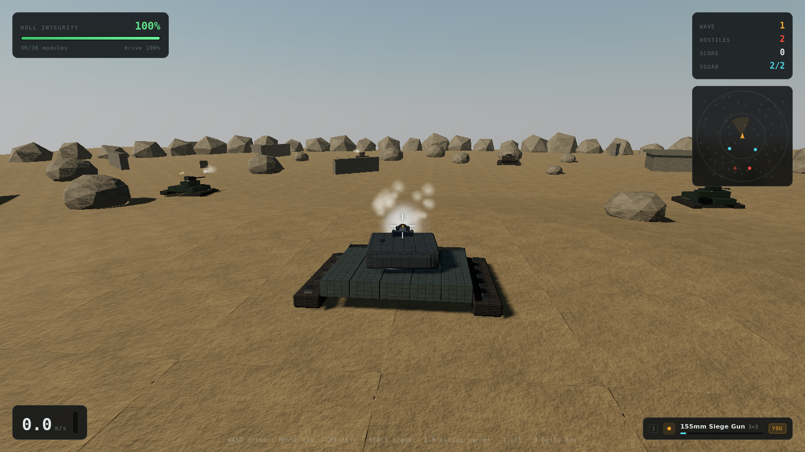
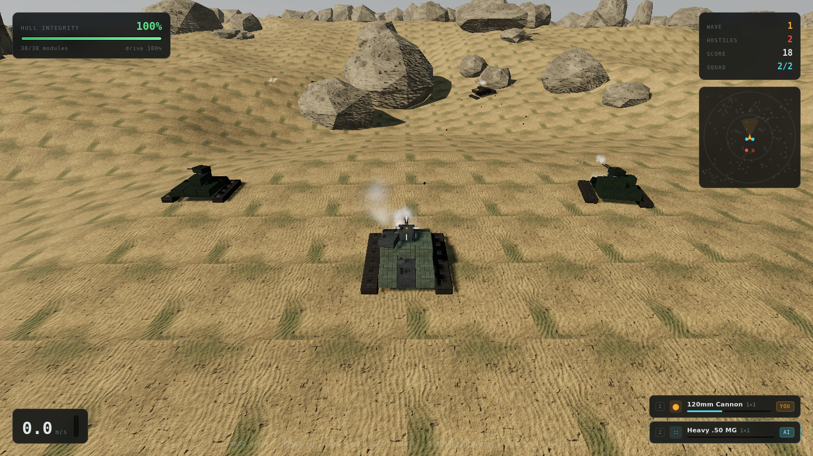

# TankWarfare

Design a tank plate by plate, then drive it into a third-person armoured battle.

Built with [Three.js](https://threejs.org). No build step, no bundler, no image assets — every
texture, sound and particle is generated procedurally at load time.

**▶ [Play it](https://fanaustinca.github.io/tankwarfare/)**


---

## Build Mode

A bird's-eye assembly deck with three phases:

| Phase | What you place | Why it matters |
|---|---|---|
| **1 · Tracks** | Tread sections on the ground grid | Drive power and top speed. Two parallel runs, hull between them. |
| **2 · Hull** | Structural blocks, stackable 3 layers | Health, mass and the platform your guns sit on. |
| **3 · Turrets** | Weapons on top of any hull column | Firepower — and big guns need a big platform. |

Everything costs money, and every kilogram costs speed. The live readout shows funds, mass,
top speed, turn rate, integrity and firepower as you build, so the trade-offs are visible
while you make them.

Left-click places. The **Delete** tool (or `X`) arms a removal mode: hovering highlights the
exact piece that will come off in red, and clicking strips it and refunds it. It stays armed
so you can clear several pieces in a row, and disarms on `Esc` or when you pick a new part.
Right-click still removes a single piece, and `Ctrl+Z` still steps back through your edits.


### Turrets take up space

Guns occupy a real footprint on the hull, so the big ones have to be designed around:

| Turret | Size | Notes |
|---|---|---|
| Light MG / Heavy .50 MG | 1×1 | Cheap suppression at two weight classes |
| 30mm Autocannon | 1×1 | Twin barrels that **alternate** — high sustained rate |
| Twin 40mm Flak | 2×1 | Both barrels fire **at once** |
| 120mm Cannon | 1×1 | The dependable main gun |
| Double 105mm | 2×1 | Two shells downrange per trigger pull |
| **155mm Siege Gun** | **3×3** | 950 dmg a shell, and the blast caves in a whole section of hull |
| Missile Pod | 1×1 | Guided warheads with a wide splash |

The 155mm is the extreme case: it claims nine cells of hull roof, so the whole chassis has to be
designed around carrying it.



### Workshop upgrades

Three upgrade tracks, bought once and applied to every part of that class — Fire Control
(damage), Drivetrain (power), and Armour Plating (module health). Four levels each, escalating cost.

## Battle Mode

Third-person combat across a **560 m** battlefield. Four maps, picked in the assembly bay:

| Map | Character |
|---|---|
| **Dune Sea** | Rolling sand, scattered boulder fields, long sightlines |
| **Ashfall** | Volcanic rock under a low hazy sun; spires everywhere |
| **Salt Flats** | Bright, near-level pan — almost no cover, pure gunnery |
| **Highlands** | Steep green ridges and dense rock; fights are close and broken up |

They differ in more than paint: terrain relief runs 7 m on the Salt Flats to 39 m in the
Highlands, and the share of shots masked by ground at 100 m goes from 24% to 73%. Long-range
guns rule the flats and are nearly useless in the highlands.



- **Physics** — momentum, mass-limited acceleration, terrain following and body roll all derive
  from what you actually built. A heavy tank wallows; a light one skitters.
- **Localised damage** — every track, plate and turret is its own module with its own health.
  Lose tracks and you slow down; lose a turret and that gun is gone. Damaged modules smoke and
  spark, and sloped armour deflects a share of incoming fire. A tank dies from *structural*
  collapse, not a single health bar.
- **AI** — hostile crews patrol, close on contact, flank toward your last known position, take
  hard cover when hurt, and lead their shots. Crew skill scales with wave tier.
- **Squad** — you fight alongside AI wingmen running the same AI on your side. Wrecked
  wingmen are replaced between waves.
- **Terrain that matters** — line of sight is tested against the height field, not just
  against cover, so crews genuinely lose sight of each other behind a ridge and manoeuvre
  to reopen the shot.
- **Independent suspension** — the tracks are flood-filled into connected runs, and each run
  is its own bogie riding a damped spring against the ground beneath it. Two side treads
  articulate separately; four corner pads give you four. A wrecked run sags off its
  torsion bars.
- **Gunner assignment** — hand any turret to an AI gunner that acquires and engages its own
  targets, or keep it on your crosshair. Mix and match mid-fight.

### Controls

| Input | Action |
|---|---|
| `W` `A` `S` `D` | Drive |
| Mouse | Aim (click to capture the pointer) |
| Left mouse | Fire your manually-crewed guns |
| Right mouse | Zoom in |
| `Space` | Brake |
| `1`–`9` | Toggle that turret between **YOU** and **AI** |
| `T` | Toggle every turret at once |
| `B` / `Esc` | Back to the assembly bay |
| `M` | Mute |

Invert-look and sensitivity live on the title screen and persist between sessions.

## Saving

Everything persists in `localStorage`, guarded so a browser that blocks storage still runs:

- **Your chassis** is auto-saved as you build and restored the next time you open the game.
- **Wave progress** is banked on every sector cleared, with best wave and best score kept
  across runs. After a defeat past wave 2 you can redeploy a couple of waves back instead of
  restarting the ladder.
- **Pulling back to refit** keeps your place: press `B` mid-run, change the tank, and the
  deploy button reads *Resume Wave N* — you return to the same wave with your score intact.
- **Settings** — invert look X/Y and mouse sensitivity.

Reset everything from the title screen.

## Portal / ad integration

The game never calls a portal SDK directly — `js/ads.js` detects whichever is present and
falls back to a visible placeholder, so the same build runs on GitHub Pages, Poki and
CrazyGames unchanged. Ad breaks pause the simulation and mute audio.

| Hook | Where it fires |
|---|---|
| loading finished | once assets are baked |
| gameplay start / stop | entering battle, returning to the bay, end of run |
| interstitial | after every third sector cleared — never mid-firefight |
| rewarded | "Repair & Continue" on the defeat screen, once per run |
| banner | 300×250 slot in the assembly bay |

To go live on a portal, add its loader to `index.html` — detection does the rest:

```html
<!-- Poki -->       <script src="//game-cdn.poki.com/scripts/v2/poki-sdk.js"></script>
<!-- CrazyGames --> <script src="https://sdk.crazygames.com/crazygames-sdk-v3.js"></script>
```

> The SDK call surface here is written defensively (feature-detected, wrapped in `try`/`catch`,
> with timeouts) but has only been exercised against the placeholder path. Verify it against
> each portal's current docs before submitting.

## Dev console

Open DevTools (`F12`) and type `TW.help()`.

```js
TW.money(10000)          // add funds
TW.upgrade()             // max every upgrade track
TW.make('tur_siege', 4)  // auto-build a chassis around a gun
TW.god()                 // toggle invulnerability
TW.spawn(3, 4)           // spawn tier-4 hostiles
TW.allies(2, 3)          // spawn friendly armour
TW.squadSize(4)          // wingmen per wave
TW.wave(7)               // skip ahead
TW.tp()                  // teleport next to the nearest hostile
TW.speed(0.25)           // slow motion
TW.parts()               // table of every part
TW.stats()               // current game state
```

## Running locally

ES modules need to be served over HTTP — opening `index.html` from the filesystem will not work.

```bash
git clone https://github.com/fanaustinca/tankwarfare.git
cd tankwarfare
python3 -m http.server 8099
# → http://localhost:8099
```

Three.js is loaded from a CDN via an import map, so there is nothing to install to play.

## How it's put together

```
js/
  main.js       bootstrap, mode switching, render loop
  parts.js      part catalogue, build data model, derived stats   (no Three.js)
  tank.js       build data → articulated chassis; per-module damage
  build.js      build mode: grid, phases, placement, economy
  battle.js     battle mode: physics, projectiles, waves, HUD
  ai.js         tank crew AI — used by both teams
  world.js      renderer, sky, terrain, cover, spatial grid, post-processing
  save.js       localStorage persistence for the tank, progress and settings
  ads.js        portal ad abstraction (Poki / CrazyGames / placeholder)
  textures.js   procedural PBR: albedo/roughness/metalness + Sobel normals
  assets.js     one-time texture bake → shared materials
  fx.js         pooled particles, explosions, decals
  audio.js      synthesised sound (WebAudio, no files)
  dev.js        the TW console API
tools/          Playwright harnesses used to test and tune the game headlessly
```

`parts.js` is deliberately free of Three.js so build data can be costed, validated, generated
for AI opponents and serialised without touching the renderer.

### Development

```bash
npm install          # Playwright, only needed for the test harnesses
bash tools/check.sh  # syntax-check every module
node tools/soak.mjs  # multi-wave run with a scripted player
node tools/duel.mjs  # measure time-to-kill
node tools/shoot.mjs # screenshot every screen
```

The harnesses drive the game with a fixed timestep so gameplay can be verified independently
of render speed.

## License

MIT
